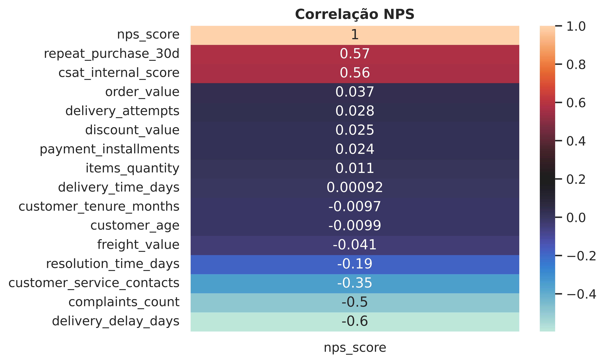

 # Análise de NPS (Net Promoter Score)

> Case preditivo de NPS para um e-commerce — Tech Challenge 1


---

## Sobre o Projeto

Este projeto tem como pano de fundo uma empresa de e-commerce em forte crescimento. Esse crescimento trouxe ganhos importantes de escala, mas também evidenciou desafios na experiência do cliente — refletidos na alta variabilidade do **Net Promoter Score (NPS)** entre diferentes clientes, mesmo quando os indicadores operacionais parecem semelhantes.

O NPS mede, a partir de uma única pergunta ("De 0 a 10, o quanto você recomendaria a empresa a um amigo?"), o quão satisfeito e leal um cliente é:

| Categoria | Notas | Perfil |
|---|---|---|
| 🟢 Promotor | 9 – 10 | Cliente satisfeito e leal, com potencial de promover a marca |
| 🟡 Neutro | 7 – 8 | Cliente satisfeito, porém vulnerável à concorrência |
| 🔴 Detrator | 0 – 6 | Cliente insatisfeito, com potencial de prejudicar a marca |

Hoje, o NPS só é coletado **depois** que a jornada de compra termina — o que limita a capacidade da empresa de antecipar problemas e agir de forma preventiva. Este projeto parte dos dados operacionais de pedidos, logística e atendimento para entender **quais fatores realmente influenciam a satisfação do cliente**, antes mesmo da aplicação da pesquisa.

## Objetivo do Projeto

Analisar dados operacionais de um e-commerce para:

- Entender o comportamento do NPS e identificar os fatores que mais impactam a satisfação do cliente, positiva ou negativamente;
- Traduzir esses achados em recomendações claras de negócio, apoiando áreas como **Logística**, **Atendimento**, **Produto** e **Pricing** na melhoria contínua da experiência do cliente;
- Refletir sobre como um modelo preditivo poderia estimar o NPS **antes** da aplicação da pesquisa, permitindo ações proativas em vez de reativas.

Mais do que buscar o modelo mais complexo, o foco é o entendimento do problema de negócio, o raciocínio analítico e a comunicação dos resultados (*storytelling* com dados).

## Descrição da Base de Dados

- **Arquivo:** [`data/raw/desafio_nps_fase_1.csv`](data/raw/desafio_nps_fase_1.csv)
- **Volume:** 2.500 pedidos × 19 colunas
- **Qualidade:** dataset limpo, sem valores nulos (verificado na etapa de EDA)
- **Granularidade:** cada linha representa um pedido (`order_id`), associado a um cliente (`customer_id`)

### Dicionário de dados

| Coluna | Descrição |
|---|---|
| `customer_id` | Identificador único do cliente |
| `customer_age` | Idade do cliente |
| `customer_region` | Região geográfica do cliente |
| `customer_tenure_months` | Tempo de relacionamento do cliente com a empresa (meses) |
| `order_id` | Identificador único do pedido |
| `order_value` | Valor total do pedido |
| `items_quantity` | Quantidade de itens no pedido |
| `discount_value` | Valor de desconto aplicado ao pedido |
| `payment_installments` | Número de parcelas do pagamento |
| `delivery_time_days` | Tempo total de entrega (dias) |
| `delivery_delay_days` | Dias de atraso na entrega |
| `freight_value` | Valor do frete |
| `delivery_attempts` | Número de tentativas de entrega |
| `customer_service_contacts` | Número de contatos do cliente com o atendimento |
| `resolution_time_days` | Tempo para resolução de problemas (dias) |
| `nps_score` | Nota de satisfação do cliente (0–10) — **variável alvo** |
| `repeat_purchase_30d` | Recompra em até 30 dias (0 = não, 1 = sim) |
| `complaints_count` | Número de reclamações registradas pelo cliente |
| `csat_internal_score` | Score interno de satisfação do cliente (CSAT) |

## Metodologia

A análise foi conduzida no notebook [`NPS - EDA.ipynb`](notebooks/NPS%20-%20EDA.ipynb), seguindo este fluxo:

1. **Carregamento e checagem de qualidade** — leitura do CSV, verificação de dimensões e ausência de valores nulos.
2. **Definição da variável alvo** — `nps_score` categorizado em Promotor / Neutro / Detrator, conforme a metodologia oficial do NPS.
3. **Estatística descritiva** — média, mediana, desvio-padrão e distribuição de todas as variáveis numéricas.
4. **Análise de correlação** — correlação de cada variável operacional com `nps_score`, para priorizar os fatores mais relevantes.
5. **Análise dos fatores críticos** — investigação de atraso na entrega, reclamações e contatos com o atendimento.
6. **Análise de perfil de cliente** — NPS médio por faixa etária, região e tempo de relacionamento.
7. **NPS × Recompra** — relação entre classificação de NPS e recompra em 30 dias.
8. **Conclusões e recomendações de negócio** — síntese dos achados em insights acionáveis.

## Principais Insights da Análise Exploratória



-  **NPS geral crítico** — mais de **80% dos clientes** foram classificados como Detratores.
-  **Atraso na entrega é o fator operacional mais determinante** — correlação de **-0,6** com o NPS. Pedidos entregues no prazo têm NPS médio de ~6,8; a partir de 1 dia de atraso o cliente já tende a virar detrator, e o efeito se intensifica a cada dia adicional.
-  **Reclamações e atendimento também pesam** — número de reclamações (**-0,5**) e contatos com o atendimento (**-0,35**) seguem o mesmo padrão: precisar reclamar ou acionar o suporte mais de uma vez já é, por si só, sinal de má experiência.
-  **O problema é o processo, não o perfil do cliente** — idade e tempo de relacionamento têm correlação praticamente nula com o NPS (-0,01); região e faixa etária também não mostram um padrão claro. O gargalo está nas operações de pós-venda, não no tipo de cliente.
-  **NPS impacta diretamente a recompra** — clientes Promotores recompram com frequência muito maior nos primeiros 30 dias do que Detratores (correlação de 0,57), conectando satisfação a retenção e receita futura.

Mais gráficos da análise estão em [`reports/figures/`](reports/figures).


## Estrutura do Repositório

```
Analise-NPS/
├── analise_de_nps/        # Pacote Python do projeto
│   └── __init__.py
├── data/
│   ├── raw/                # Dados brutos (desafio_nps_fase_1.csv)
├── docs/                   # Documentação do projeto (mkdocs)
├── notebooks/
│   └── NPS - EDA.ipynb     # Notebook principal com toda a EDA
├── references/             # Dicionários de dados e materiais de apoio
├── reports/
│   ├── figures/             # Gráficos exportados da EDA
│   └── apresentacao/        # Apresentação executiva (NPS.pptx)
├── Makefile                # Comandos de setup, lint e formatação
├── requirements.txt        # Dependências do projeto
├── pyproject.toml          # Configuração do projeto e do ruff
├── LICENSE
└── README.md
```

## Tecnologias Utilizadas

- **Linguagem:** Python 3.14
- **Manipulação de dados:** `pandas`, `numpy`
- **Visualização:** `matplotlib`, `seaborn`, `plotly`
- **Ambiente:** Jupyter Notebook
- **Versionamento:** Git / GitHub

## Como Reproduzir os Resultados

**Pré-requisitos:** Python 3.14 e Git instalados.

```bash
# 1. Clone o repositório
git clone https://github.com/Eric-Schwinn-Lima/Analise-NPS.git
cd Analise-NPS

# 2. (Recomendado) Crie e ative um ambiente virtual
python -m venv venv
source venv/bin/activate        # Linux/macOS
venv\Scripts\activate           # Windows

# 3. Instale as dependências
pip install -r requirements.txt
# ou, usando o Makefile:
make requirements

# 4. Inicie o Jupyter e abra o notebook
jupyter notebook "notebooks/NPS - EDA.ipynb"
```

> **Atenção ao caminho do CSV:** a célula de carregamento usa `pd.read_csv('desafio_nps_fase_1.csv')`, um caminho relativo à pasta onde o notebook é executado. Como o arquivo está em `data/raw/`, copie-o para dentro de `notebooks/` **ou** altere a célula para `pd.read_csv('../data/raw/desafio_nps_fase_1.csv')` antes de rodar.
>
> O notebook também foi originalmente desenvolvido no Google Colab — nesse caso, basta fazer upload do `desafio_nps_fase_1.csv` para o ambiente da sessão antes de executar as células.


## Entregáveis do Desafio

| Entregável | Status | Local |
|---|---|---|
| Entendimento do negócio e definição da target | ✅ Concluído | Este README |
| Análise Exploratória (EDA) | ✅ Concluído | [`notebooks/NPS - EDA.ipynb`](notebooks/NPS%20-%20EDA.ipynb) |
| Apresentação executiva (slides) | ✅ Concluído | [`reports/apresentacao/NPS.pptx`](reports/apresentacao/NPS.pptx) |
| Vídeo executivo | ✅ Concluído | https://drive.google.com/file/d/1ufcjpiu2tfUk7NERw7Y5opgxdBrdzFUw/view?usp=sharing |

## Licença

Este projeto está licenciado sob a licença MIT — veja [LICENSE](LICENSE) para mais detalhes.

## Autor

**Eric Schwinn Lima** · [GitHub](https://github.com/Eric-Schwinn-Lima)
